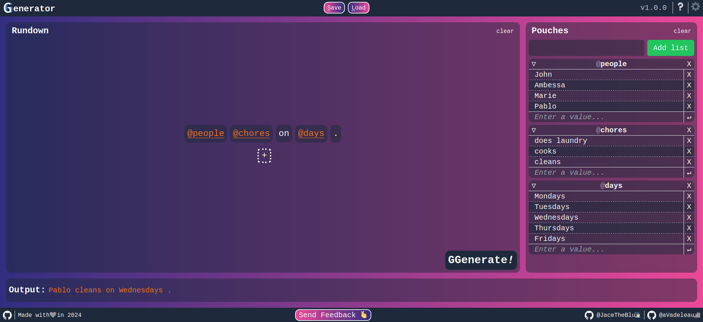

# Welcome to [GGenerator](https://ggenerator-beta.vercel.app/) *!*

>This  application  aims to be a multi purpose generator for every cases where you need random things.

<h2 style="color: grey; font-style: italic; display:flex">
    @ 

    Use cases
    

</h2>

- ### GameMaster

- ### Movies selector

- ### Shared Flat

- A shared flat wants to plans chores everyday, it is possible just add 3 lists (called pouches) :

  - One for the peoples in the flat
  - A second for the household chores
  - A third for the days

Make a sentence and GGenerate !

<h2 style="color: grey; font-style: italic; display:flex">
    @ 

    How to access ?
    

</h2>

> Go to : <https://ggenerator-beta.vercel.app/>.  
Follow the onboarding tutorial with an example for a better understanding of the application.

<h2 style="color: grey; font-style: italic; display:flex">
    @ 

    Features
    

</h2>

- [x] Add random sentence generation ( based on pouches and the template sentence)
- [x] Possibility to rename/delete pouches and pouches elements
- [x] Add tutorials ( onboarding, deep guide, empty tips)
- [x] Add Drag & Drop functionality
- [x] Save & Load Functions
- [x] Persisent save with local storage

- ### *To do*

- [ ] History of generated sentences
- [ ] Different kind of themes ( light, dark, colored ..)
- [ ] Probability on pouches elements
- [ ] Random generation with or without replacement
- [ ] Community database
- [ ] Pouches of different types ( numbers, images, date ...)

## $${\color{grey}\textsf{@}\color{orange}\textbf{\texttt{Test}}}$$

<h2 style="color: grey; font-style: italic; display:flex">
    @ 

    FAQ
    

</h2>

### Is it available in \<Insert Language> ?

> The app is currently available in french and english only.  
> Other languages can be added on demand. :grinning:

### Are you selling my data !?

> Nope, first the app is **open-source** so you can check yourself in the code.  
> Everything is stored on your navigator, we don't receive any data. *We don't have money to store them anyway*   
> So be creative !

### I have an idea ! How can I contact you ?

- #### Bug report
    
    > Here is the link : [Issues](https://github.com/JaceTheBlu/GGenerator/issues/new), if possible share a screenshots and the steps to reproduce, thanks !
- #### Feedback
  
    > Here you can find the english version : [Google Form EN](https://forms.gle/2JKbUNFE4Dd8JMUL9).  
    Pour la version baguette c'est ici : [Google Form FR](https://forms.gle/6UpoQnbn84WBtZk1A)
- #### Directly
  
    > [@JaceTheBlu](https://github.com/JaceTheBlu) 🧙‍♂️  
     [@aVadeleau](https://github.com/aVadeleau) 🎢

